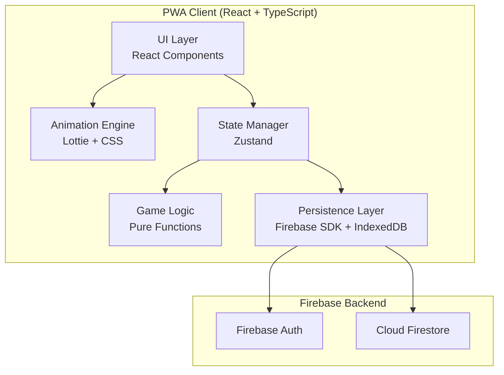
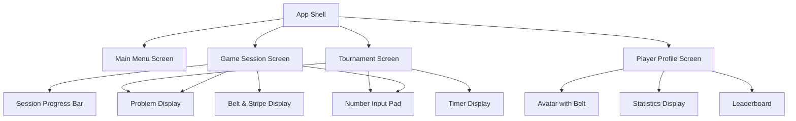

# Design Document: Judo Math Game

## Overview

Judo Math is a cross-platform educational math game for first-grade children (ages 6-7) that combines addition and subtraction practice (operands 0-20) with a Judo belt progression system. The game runs as a Progressive Web App (PWA) on modern browsers and Android 8.0+, providing equivalent functionality across platforms.

### Key Design Decisions

1. **PWA-first approach**: A single codebase (React + TypeScript) deployed as a PWA satisfies both web browser and Android requirements without maintaining separate native codebases. PWAs support offline play, home screen installation on Android, and responsive layouts.

2. **Firebase backend**: Firebase Authentication (anonymous + optional account linking) and Firestore provide cross-platform data sync with offline-first capabilities, meeting the persistence and sync requirements without building custom infrastructure.

3. **Lottie + CSS animations**: Lottie handles complex belt ceremony animations (pre-authored, lightweight JSON), while CSS transitions/animations handle simpler feedback (correct/incorrect). This achieves 30fps on target devices without a heavy game engine.

4. **Pure logic separation**: Math problem generation, scoring, and belt progression are pure functions with no side effects, enabling thorough property-based testing of core game mechanics.

## Architecture



### Layer Responsibilities

- **UI Layer**: React components handling layout, input, and rendering. Responsive via CSS Grid/Flexbox with breakpoints at 768px.
- **Animation Engine**: Manages Lottie player instances for ceremonies and CSS class toggling for micro-animations. Targets 30fps minimum.
- **Game Logic**: Pure TypeScript functions for problem generation, answer validation, scoring, and belt progression calculations. No side effects.
- **State Manager**: Zustand store holding current session state, player profile, and UI state. Single source of truth for the client.
- **Persistence Layer**: Abstracts Firebase Firestore for cloud sync and IndexedDB for offline caching. Handles conflict resolution on reconnect.

## Components and Interfaces

### 1. Math Problem Generator

```typescript
interface MathProblem {
  id: string;
  operand1: number;       // 0-20
  operand2: number;       // 0-20
  operator: '+' | '-';
  correctAnswer: number;  // 0-20
}

interface ProblemGeneratorConfig {
  count: number;          // problems per session (default: 10)
  maxOperand: number;     // maximum operand value (default: 20)
  maxResult: number;      // maximum result value (default: 20)
}

// Pure function - no side effects
function generateSession(config: ProblemGeneratorConfig): MathProblem[];
function validateAnswer(problem: MathProblem, playerAnswer: number): boolean;
```

### 2. Belt Progression Engine

```typescript
enum Belt {
  White = 0,
  Yellow = 1,
  Orange = 2,
  Green = 3,
  Blue = 4,
  Brown = 5,
  Black = 6,
}

interface PlayerProgress {
  currentBelt: Belt;
  currentStripes: number;  // 0-2 (3 stripes triggers promotion)
  totalSessions: number;
  totalCorrect: number;
  totalProblems: number;
}

interface SessionResult {
  correctCount: number;
  totalCount: number;
  score: number;           // percentage (0-100)
}

interface ProgressionResult {
  newProgress: PlayerProgress;
  stripeAwarded: boolean;
  beltPromotion: boolean;
  newBelt?: Belt;
}

// Pure functions
function calculateScore(correctCount: number, totalCount: number): number;
function evaluateProgression(
  currentProgress: PlayerProgress,
  sessionResult: SessionResult
): ProgressionResult;
```

### 3. Tournament Manager

```typescript
interface TournamentState {
  currentSessionIndex: number;  // 0-2 (3 sessions total)
  sessions: TournamentSession[];
  startTime: number;
  isActive: boolean;
}

interface TournamentSession {
  problems: MathProblem[];
  answers: number[];
  score: number;
  timePerProblem: number[];  // milliseconds per problem
}

interface TournamentResult {
  totalScore: number;
  totalTime: number;         // milliseconds
  sessionsCompleted: number;
}

interface LeaderboardEntry {
  playerId: string;
  playerName: string;
  totalScore: number;
  totalTime: number;
  date: string;
}

function calculateTournamentResult(state: TournamentState): TournamentResult;
```

### 4. Animation Engine

```typescript
interface AnimationConfig {
  type: 'correct' | 'incorrect' | 'stripe' | 'belt_ceremony' | 'idle_reminder';
  duration: number;        // milliseconds
  beltColor?: Belt;        // for belt_ceremony type
}

interface AnimationEngine {
  play(config: AnimationConfig): Promise<void>;
  stop(): void;
  isPlaying(): boolean;
}
```

### 5. Persistence Service

```typescript
interface PersistenceService {
  saveProgress(playerId: string, progress: PlayerProgress): Promise<void>;
  loadProgress(playerId: string): Promise<PlayerProgress | null>;
  saveLeaderboard(entry: LeaderboardEntry): Promise<void>;
  getLeaderboard(limit: number): Promise<LeaderboardEntry[]>;
  syncOfflineChanges(): Promise<void>;
}
```

### 6. UI Components



## Data Models

### Firestore Document Structure

```
/players/{playerId}
  - displayName: string
  - currentBelt: number (0-6)
  - currentStripes: number (0-2)
  - totalSessions: number
  - totalCorrect: number
  - totalProblems: number
  - createdAt: timestamp
  - updatedAt: timestamp

/leaderboard/{entryId}
  - playerId: string
  - playerName: string
  - totalScore: number
  - totalTime: number
  - date: timestamp
```

### Local State (Zustand Store)

```typescript
interface GameStore {
  // Player
  player: PlayerProgress | null;
  playerId: string | null;
  
  // Current session
  currentSession: {
    problems: MathProblem[];
    currentIndex: number;
    answers: (number | null)[];
    startTime: number;
  } | null;
  
  // Tournament
  tournament: TournamentState | null;
  
  // UI state
  isLoading: boolean;
  activeScreen: 'menu' | 'game' | 'tournament' | 'profile';
  animationPlaying: boolean;
}
```

### IndexedDB Schema (Offline Cache)

```
ObjectStore: "playerProgress"
  - key: playerId
  - value: PlayerProgress + lastSyncTimestamp

ObjectStore: "pendingSync"
  - key: auto-increment
  - value: { action: string, data: any, timestamp: number }
```


## Correctness Properties

*A property is a characteristic or behavior that should hold true across all valid executions of a system—essentially, a formal statement about what the system should do. Properties serve as the bridge between human-readable specifications and machine-verifiable correctness guarantees.*

### Property 1: Problem generation invariants

*For any* generated game session, every MathProblem must satisfy: the operator is either '+' or '-', both operands are integers in [0, 20], and the correct answer is an integer in [0, 20].

**Validates: Requirements 1.1, 1.2, 1.3, 1.4**

### Property 2: Score calculation correctness

*For any* correctCount and totalCount where 0 ≤ correctCount ≤ totalCount and totalCount > 0, calculateScore(correctCount, totalCount) must equal Math.round(correctCount / totalCount * 100).

**Validates: Requirements 6.2**

### Property 3: Stripe award threshold

*For any* valid PlayerProgress and SessionResult, a stripe is awarded if and only if the session score is 75% or higher. When score < 75%, the player's progress must remain unchanged.

**Validates: Requirements 3.3, 3.4**

### Property 4: Belt promotion mechanics

*For any* PlayerProgress where currentStripes equals 2 and the player is not already at Black belt, if a stripe is awarded, the player's belt must advance to the next color in the sequence and the stripe count must reset to 0.

**Validates: Requirements 3.5, 3.6**

### Property 5: Session contains exactly 10 problems

*For any* call to generateSession with the default configuration, the returned array must contain exactly 10 MathProblem objects.

**Validates: Requirements 6.1**

### Property 6: Tournament consists of exactly 3 sessions

*For any* tournament state that has completed, it must contain exactly 3 sessions, each with exactly 10 problems.

**Validates: Requirements 7.2**

### Property 7: Tournament score aggregation

*For any* completed tournament with 3 session results, the total tournament score must equal the total correct answers across all sessions divided by the total problems across all sessions, expressed as a percentage.

**Validates: Requirements 7.4**

### Property 8: Leaderboard ordering and size

*For any* set of leaderboard entries, getLeaderboard(10) must return at most 10 entries sorted by totalScore in descending order (ties broken by lowest totalTime).

**Validates: Requirements 7.6**

### Property 9: Avatar belt color mapping

*For any* Belt enum value, the avatar color mapping function must return a distinct, valid color string, and the mapping must be bijective (no two belts map to the same color).

**Validates: Requirements 8.4**

### Property 10: Player progress persistence round-trip

*For any* valid PlayerProgress object, serializing it to the persistence format and then deserializing it back must produce an object equal to the original, preserving currentBelt, currentStripes, totalSessions, totalCorrect, and totalProblems.

**Validates: Requirements 9.1, 9.2, 9.3**

### Property 11: Responsive layout breakpoint behavior

*For any* viewport width in [320, 1920], the layout system must apply single-column layout when width < 768px and multi-column layout when width ≥ 768px.

**Validates: Requirements 11.4, 11.5**

## Error Handling

### Input Validation

| Error Condition | Handling Strategy |
|---|---|
| Player submits non-numeric input | Ignore input; number pad only allows valid digits |
| Player submits answer outside [0, 20] | Disable submit button until value is in valid range |
| Network disconnected during save | Queue changes in IndexedDB; sync on reconnect |
| Firebase auth token expired | Silent token refresh; retry operation |
| Firestore write conflict | Last-write-wins with timestamp comparison |
| Animation fails to load | Skip animation; proceed with game flow |
| LocalStorage/IndexedDB unavailable | Fall back to in-memory state with warning |

### Offline Behavior

The game must function fully offline after initial load:
- Math problem generation is client-side (pure functions)
- Progress is cached in IndexedDB
- Leaderboard shows cached data with "offline" indicator
- On reconnect, pending changes sync to Firestore using a queue

### Graceful Degradation

- If Lottie animations fail to load: fall back to CSS animations for feedback
- If Firebase is unreachable: operate in local-only mode
- If device performance is low: reduce animation complexity (skip particle effects)

## Testing Strategy

### Property-Based Tests (fast-check)

The project will use [fast-check](https://github.com/dubzzz/fast-check) for property-based testing in TypeScript. Each property test runs a minimum of 100 iterations.

| Property | Module Under Test | Generator Strategy |
|---|---|---|
| Property 1: Problem generation invariants | `generateSession()` | Random ProblemGeneratorConfig |
| Property 2: Score calculation | `calculateScore()` | Random integers (correctCount ≤ totalCount) |
| Property 3: Stripe award threshold | `evaluateProgression()` | Random PlayerProgress × Random SessionResult |
| Property 4: Belt promotion mechanics | `evaluateProgression()` | PlayerProgress with stripes=2, score≥75% |
| Property 5: Session size | `generateSession()` | Random configs |
| Property 6: Tournament structure | Tournament state machine | Random tournament flows |
| Property 7: Tournament score aggregation | `calculateTournamentResult()` | Random sets of 3 SessionResults |
| Property 8: Leaderboard ordering | `getLeaderboard()` | Random arrays of LeaderboardEntry |
| Property 9: Belt color mapping | `getBeltColor()` | All Belt enum values |
| Property 10: Persistence round-trip | `save/loadProgress()` | Random PlayerProgress objects |
| Property 11: Layout breakpoint | Layout utility | Random viewport widths in [320, 1920] |

Each test is tagged with: `Feature: judo-math-game, Property {number}: {property_text}`

### Unit Tests (Vitest)

- Answer validation: correct/incorrect for specific examples
- Belt ceremony trigger conditions
- Inactivity timer (30s threshold with mocked timers)
- Tournament timer display formatting
- UI component rendering (React Testing Library)

### Integration Tests

- Firebase persistence: save and load on real Firestore emulator
- Cross-platform sync: simulate multi-device scenario
- PWA service worker: offline caching and background sync
- Animation performance: measure frame rates on target devices

### End-to-End Tests (Playwright)

- Full game session flow: start → answer 10 problems → see results
- Belt promotion flow: earn 3 stripes → ceremony → new belt
- Tournament flow: 3 sessions → leaderboard update
- Responsive layout: test at 320px, 768px, 1920px viewports
- Offline mode: disconnect → play → reconnect → verify sync

### Test Configuration

```json
{
  "testFramework": "vitest",
  "pbtLibrary": "fast-check",
  "pbtIterations": 100,
  "e2eFramework": "playwright",
  "firebaseEmulator": true
}
```
