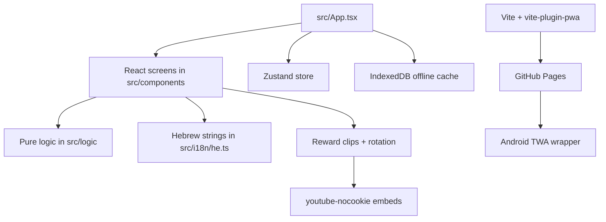

# Code Architecture

Judo Math is a React + TypeScript + Vite app with a PWA build and an Android
Trusted Web Activity wrapper.

## Runtime Overview



## Entry Points

| File | Role |
| --- | --- |
| `index.html` | Hebrew RTL document shell and PWA meta tags. |
| `src/main.tsx` | React bootstrapping. |
| `src/App.tsx` | Top-level screen state, player loading, auto-save, and progression wiring. |
| `vite.config.ts` | Vite, PWA manifest, service worker, and GitHub Pages base path. |

## Screen Model

`src/App.tsx` currently controls these screens:

- `menu`
- `game`
- `sessionResults`
- `tournament`
- `tournamentResults`
- `profile`

The active screen is local React state in `App.tsx`. The Zustand store still
holds shared player state and some older app state fields, but navigation is
currently driven by `App.tsx`.

## Component Structure

| Component | Purpose |
| --- | --- |
| `MainMenu` | Landing screen with belt badge and main actions. |
| `GameSession` | Normal 10-question practice session. |
| `ProblemDisplay` | Large math problem, feedback, and correct-answer reveal. |
| `AnswerChoices` | Six-choice answer grid for normal practice. |
| `RewardClip` | Full-screen reward video modal. |
| `SessionResults` | End-of-session score, stripe, and promotion messaging. |
| `TournamentScreen` | Classic tournament flow or belt-based championship flow. |
| `TournamentResults` | Tournament/championship score, time, and placement summary. |
| `PlayerProfile` | Belt, stripes, and lifetime stats. |
| `BeltCeremony` | Promotion celebration overlay. |
| `NumberInput` | Numeric keypad used by tournament mode. |

## Core Logic Modules

| Module | Responsibility |
| --- | --- |
| `problemGenerator.ts` | Generate valid arithmetic sessions and validate answers. |
| `distractors.ts` | Build deterministic six-choice answer sets. |
| `scoring.ts` | Convert correct/total counts into a percentage. |
| `beltProgression.ts` | Apply 75% stripe rule and 3-stripe belt promotion. |
| `tournament.ts` | Start tournaments, complete rounds, and compute final results. |
| `championship.ts` | Map belts to national championship stages and calculate placement. |
| `clipRotation.ts` | Pick reward clips without repeats during a full rotation. |
| `beltColors.ts` | Map belt enum values to visual colors. |
| `responsive.ts` | Helpers for responsive behavior tests. |

The logic modules are intentionally UI-independent so they can be tested without
rendering React.

## Data and Types

`src/types/index.ts` defines the shared TypeScript model:

- `Belt`
- `MathProblem`
- `ProblemGeneratorConfig`
- `PlayerProgress`
- `SessionResult`
- `ProgressionResult`
- `TournamentState`
- `TournamentSession`
- `TournamentResult`
- `ChampionshipStage`
- `ChampionshipStageId`
- `LeaderboardEntry`
- `AnimationConfig`
- `GameStore`

The belt enum is numeric and ordered, so promotion can move from one belt to the
next by incrementing the belt value.

## Persistence

The active persistence path is local-only:

1. `App.tsx` initializes `offlineCache`.
2. It loads `local-player` progress from IndexedDB.
3. Store changes are auto-saved back to IndexedDB.

`src/persistence/firebaseService.ts` and `firebaseConfig.ts` exist for optional
future sync/leaderboard work, but Firebase is not wired into the default runtime
flow today.

## Reward Clip Pipeline

Clip data is generated and checked through scripts:

- `scripts/clip-sources.json` stores source/search configuration.
- `scripts/fetch-judo-clips.mjs` refreshes `src/data/judoClips.ts`.
- `scripts/validate-clips.mjs` checks metadata availability.
- `scripts/check-reward-clips-browser.mjs` checks embeds in a browser context.

Release checklist for clip changes:

```bash
npm run clips:fetch
npm run clips:validate
npm run clips:check-browser
npm run test
npm run build
```

## Tests

The project uses Vitest for unit and integration tests, with Playwright
available for browser-level tests.

Important test areas:

- Problem generation constraints.
- Scoring and progression.
- Tournament aggregation.
- Offline cache behavior.
- Clip rotation behavior.
- Main game session feedback and streak praise.
- Component rendering and accessibility states.

Run all unit tests:

```bash
npm run test
```

## Championship Flow

The visible tournament card in `MainMenu` starts `TournamentScreen` with
`variant="championship"`. The screen derives the active stage from the current
belt:

- White / Yellow: qualifiers.
- Orange / Green: quarter final.
- Blue: semi final.
- Brown / Black: final.

Championship mode uses one timed 20-question session. Every question has its own
countdown; timeout records a wrong answer and advances. Results include
`totalCorrect`, `totalProblems`, `placement`, and `championshipStage`.

The older 3-session tournament behavior remains available by rendering
`TournamentScreen` with the default `variant="classic"`.

## Web Deployment

Production web deployment is handled by `.github/workflows/deploy.yml`:

1. Checkout.
2. Install dependencies.
3. Run tests.
4. Generate raster icons.
5. Build with Vite.
6. Copy `index.html` to `404.html` for SPA fallback.
7. Deploy `dist/` to GitHub Pages.

`vite.config.ts` uses `/JudoMath/` as the production base path unless
`VITE_BASE` is overridden.

## Android Packaging

The Android app is a Trusted Web Activity. It wraps the deployed PWA rather than
duplicating game logic in native Android code.

See `docs/ANDROID.md` for local Bubblewrap builds, GitHub Actions artifacts,
keystore secrets, AAB upload notes, and Digital Asset Links requirements.
